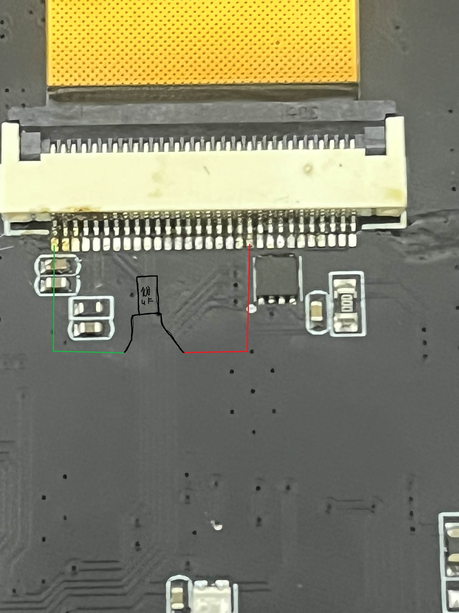

# Fix-Tembed-cc1101-black-screen

## Problem

Some Tembed CC1101 boards show a black screen issue where the backlight works but no image is displayed.
The ESP32 works normally but the display stays blank.

This problem appears after some time even if reflashing temporarily fixes it.

## Root Cause

The display does not receive stable power on the 3.3V line.
Voltage drops cause the screen controller to fail silently.

## Solution

Add a **100µF capacitor** between **3.3V** and **GND** on the display power pins.

This stabilizes the voltage and permanently fixes the black screen issue.

## Required Parts

* 1x 100µF capacitor
* Soldering iron
* Thin wires or direct soldering

## Wiring Diagram

Below is the schematic showing exactly where to solder the capacitor.

### Connections

* Capacitor **positive (+)** → **3.3V** pin of the display
* Capacitor **negative (-)** → **GND** pin of the display

⚠️ Make sure polarity is correct. Reversing the capacitor may damage the board.

## Result

After adding the capacitor:

* Display works reliably
* No more black screen
* No need for reflashing or resets

## Notes

* This fix was tested with a 100µF capacitor
* Capacitors between 47µF and 220µF should also work

## Credits

Discovered and tested by Lightse.
Feel free to share and improve this fix.

---
